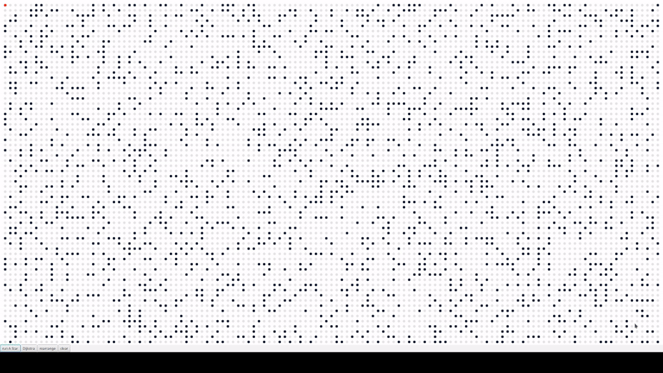

# Path Finding Visualization

A simple path finding visualization, demostrating A* and Dijkstra's shortest path algorithms. I wrote this project in my first year of university using [javafx 11](https://openjfx.io/) and had a lot of fun during the process.

## How it works

When the application starts, a random maze (which you can configure in `Constants.java`) is generated. By selecting a starting point and a finishing point you can choose one of the following algorithims to visualize:

1. A* with [Euclidean distance](https://en.wikipedia.org/wiki/Euclidean_distance)


2. Dijkstra with [Priority queues](https://en.wikipedia.org/wiki/Priority_queue)



## How to run

### Linux and Mac

1. clone this repository.
```
git clone https://github.com/itzloop/AStar.git
```
2. First install [Java 11](https://openjdk.org/projects/jdk/11/)
3. Then with `gradlew` script run the following to initialize the project, get the dependencies and run it.

```bash
# Initialize the project
$ ./gradlew init

# Build the project
$ ./gradlew build

# Run the project
$ ./gradlew run
```

4. Enjoy

### Windows

For windows the steps are the same. Only run the `gradlew.bat` script instead of `gradlew`


## Configuration

You can configure following asspects of the project by changing the corresponding value in the `Constants.java` file.

- How many obstacles are generated by changing `Constants.ObstacleRatio`.
- The size of the maze by changing `Constants.NodeDistance and Constants.Radius`.
- Some color options.
- How fast the visualization progresses by changing `Constants.SleepDelay`.